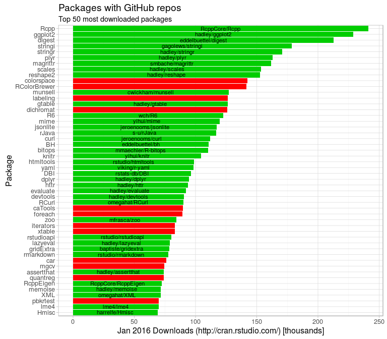
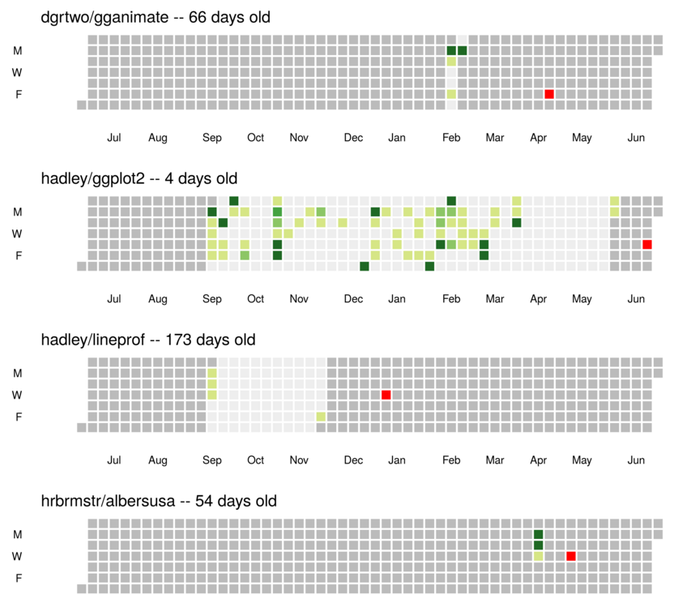
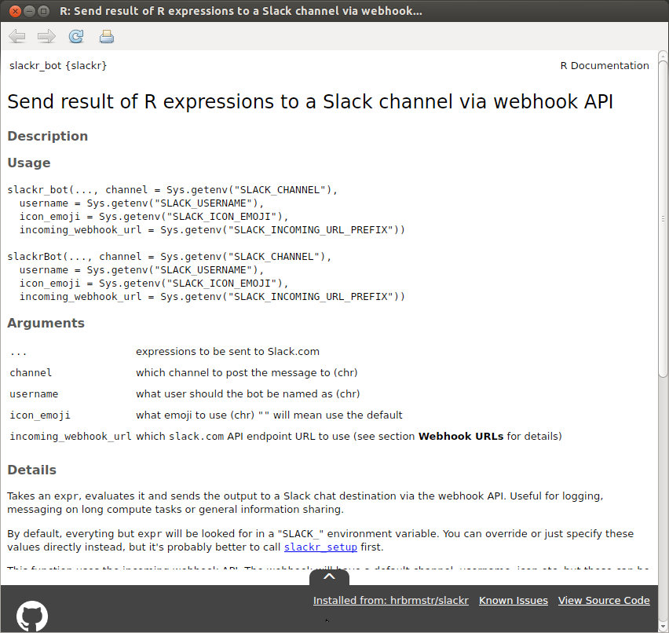
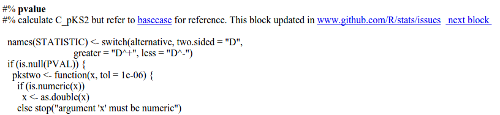

The Problem/Motivation:
=======================

[CRAN](https://cran.r-project.org/) is a remarkable resource. It is a
trusted repository of tested and peer-reviewed R packages that is
fundamentally essential to the R community. It is not the only source of
R packages however. The inevitable trade-off for having entry
requirements to CRAN is that development of packages occurs elsewhere.
At present, GitHub is serving as a similarly valuable resource for R
packages, but with no barrier to entry. The downside being that packages
may contain any combination of: fatal bugs, malicious code (intentional
or innocent), and incorrect/out of date/missing documentation, and these
packages may change at a moment's notice. At present, the onus lies
entirely with users to manage this.

Despite best practices ([such as the R Consortium
guidelines](https://www.r-consortium.org/news/blogs/2015/08/best-practices-using-r-securely))
recommending only securely connecting to CRAN mirrors, GitHub is
undeniably being used as an alternative host for R packages. The
prevalence of this is highlighted by examining the top 50 most
downloaded packages from the [RStudio CRAN
mirror](http://cran.rstudio.com/). During January of 2016, 38 of the top
50 most downloaded packages had an available GitHub repository (refer
Fig. 1, not including the [read-only mirror](https://github.com/cran)).

GitHub serves as an extremely useful tool for developing R packages,
providing both a mechanism for version control and a system for
reporting issues, and users should not be discouraged from interacting
with the wider open-source community because R is not able to securely
load code from GitHub. Futhermore, GitHub packages have an advantage
over CRAN packages (less so with the read-only mirror); the local raw
source of installed CRAN packages is currently stored in a binary
format, preventing searching and inspection directly from within the
filesystem. The current options for viewing the body of a function often
become tiresomely difficult when the function is either not explicitly
exported, is actually a method, or is derived from another language
(e.g. `C`). For example, the raw `C` source (`SEXP mutate_impl`) for
`dplyr::mutate` is very difficult (not possible?) to find from within R,
but nearly trivial to search for on GitHub.

It is unlikely that GitHub is going away soon. I propose embracing it
more tightly.

The Plan/Proposal:
==================

I propose a combined research project/development effort over the course
of approximately 6 months. I foresee three main goals that could be
achieved in order to strengthen the integration between GitHub and R.
These are:

-   Fortifying the loading of GitHub packages to a reasonable, and open,
    level of trust.

-   Providing the user with more information regarding GitHub-sourced
    packages.

-   Closing the feedback loop such that issues encountered while using a
    GitHub loaded package can be directed back to the GitHub repository
    easily.

In order to achieve these goals, I intend to undertake the following
activities (subject to findings):

-   **A study of the existing landscape regarding R/GitHub integration**
    [*6 weeks*]
    -   what GitHub-related R packages are currently available/under
        development?
    -   what features do they provide that could be integrated?
    -   what features are missing entirely but could be developed?
    -   what are the limitations of tighter integration bewtween R and
        GitHub?
-   **Development of tools to securely load GitHub R packages into a
    library** [*6 weeks*]
    -   code checking/sanitising.
    -   hash/checksum comparisons.
    -   running of `devtools::check()` on packages loaded from GitHub.
    -   optional conditional loading depending on TravisCI status.
-   **Development of tools to provide the user with more information**
    [*6 weeks*]
    -   clear identification of packages which have been loaded from
        GitHub.
    -   information regarding how old the current version is,
        particularly in context to that package's development.
    -   more visible `diff` information for updated packages.
    -   increased literate programming intimately tied to GitHub issues.
-   **Development of tools to assist the user in contributing to the
    GitHub repository, either through Issues or additional code** [*6
    weeks*]
    -   providing a zero-effort channel back to the GitHub repository
        from which the package was loaded.
    -   providing a mechanism by which a user may view diffs between
        commits to a given function (from within R).
    -   providing embedded literate programming ties back to source
        functions.

Development Already Underway:
=============================

Some of the tools that would facilitate this project are already under
development in my own GitHub repository, and others are likely to be
under development elsewhere. For example, regarding the issue of
providing more information of how old a GitHub package is relative to
its development (*was the package installed during a peak or trough in
the developer's cycle? Was it just before or after a series of major
updates?*) combined with the issue of clearer identification of GitHub
loaded packages and a direct line back to the originating repository, [I
have a proof-of-concept package
'githubtools'](http://github.com/jonocarroll/githubtools) which:

-   scans the user's `installed.packages`,
-   identifies which packages have been loaded from GitHub,
-   retrieves the commit history for each of those packages,
-   displays the installation date alongside the commit history (refer
    Fig. 2).

Additionally, this package provides a mechanism by which additional
features can be added to R documentation when a package is installed
from GitHub. This discreetly adds a pull-up tab which, when hovered
over, expands to a small overlay which notifies the user of the
originating GitHub repository, and provides links to such (main
repository, file in question, and Issues page, refer Fig. 3). The way in
which this is currently achieved is very much a hack, and it would be
considerably more beneficial to have this incorporated either into
RStudio or R.

Regarding the issue of increasing the connection between functions,
their source, and their intentions, [I have a proof-of-concept package
'literate'](http://github.com/jonocarroll/literate) which, for code
within a package, allows embedding of roxygen-style comments in the code
itself that survive installation and which detail the intentions of the
programmer. When viewed (via `browseURL` currently) the code appears
alongside hyperlinks between logical blocks with the developer's
comments. These comments can include hyperlinks bewteen code blocks, and
importantly, to external sources, such as GitHub issues (refer Fig. 4 as
a fictional example).

Deliverables/Dissemination:
===========================

A final report will be produced outlining both the findings of the
research phase and achievements of the development phase. The
development phase itself would lead to the production of either one or
multiple R packages which achieve the goals set out; or contributions to
R/RStudio themselves, depending on the findings.

100% of the content (research, code, presentation) of this project will
remain open source and disseminated via GitHub. The findings and
subsequent developed package(s) would be highlighted at a suitable R
meeting (e.g. useR) and promoted on social media.

In order to enhance the level of trust, I would be welcoming of
migrating the completed packages to a respectable authority such as
[ROpenSci](https://github.com/ropensci).

How the ISC Can Help/Finance:
=============================

Funds will be spent on dedicated development hours for myself. Few
additional resources, if any, would be required. Potentially, literature
may be required should development exceed my current knowledge base.
Potentially, a small component of travel may be beneficial (e.g.
contribution towards useR 2017 or collaboration). Any contribution from
the ISC is most welcomed, regardless of the amount, and I welcome any
recommendations that the ISC may have towards how these funds may be
best used.

I thank you kindly for your consideration, and look forward to your
comments.

~ Jonathan Carroll, July 2016.

Created with RMarkdown.  
The source for this document is hosted on GitHub:
[<https://github.com/jonocarroll/RConsProp2016>](https://github.com/jonocarroll/RConsProp2016)  
Template adapted from:
[<https://github.com/svmiller/svm-r-markdown-templates>](https://github.com/svmiller/svm-r-markdown-templates)

Fig 1. Top 50 most downloaded packages from the RStudio CRAN mirror in
Januaray of 2016. Note that of these 38/50 (75%) have GitHub
repositories.

Fig 2. Installed packages are scanned, and GitHub-sourced packages are
processed; commit histories retrieved and displayed alongside the
installation date (red), in the style of a GitHub activity chart. This
functionality is currently provided by
[<http://github.com/jonocarroll/githubtools>](http://github.com/jonocarroll/githubtools)
(under development).

Fig 3. Overlay added to R documentation. When not in use, contracts
dynamically down to just the pull-tab, and raises on hover. This is
currently achieved by masking much of `devtools::install_github`,
injecting HTML directly into the `roxygen` comment blocks, and hijacking
`Rd2html` from within the call stack. This functionality is currently
provided by
[<http://github.com/jonocarroll/githubtools>](http://github.com/jonocarroll/githubtools)
(under development).

Fig 4. Hyperlinked literate-programming source code with a (fictional)
link to the GitHub issue where the motivation for the structure has been
discussed. This functionality is currently provided by
[<http://github.com/jonocarroll/literate>](http://github.com/jonocarroll/literate)
(under development).
